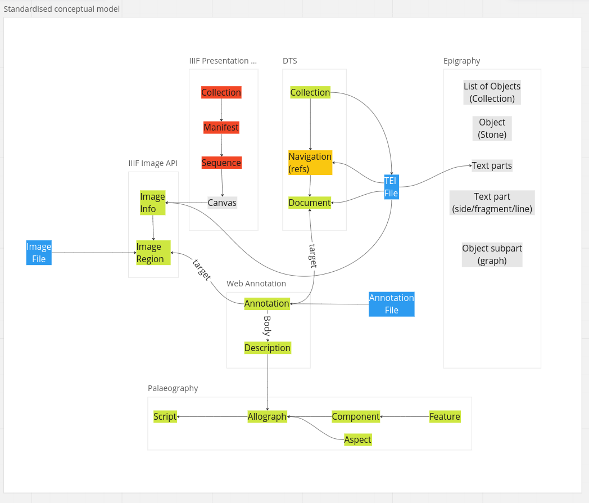

# Data & service interoperability

## Data flow

Below is a step-by-step summary of how the annotator currently interacts with external content sources:

1. request to the DTS Collection API ([currently a static copy](https://kingsdigitallab.github.io/crossreads/data/2023-01/collection.json)) to obtain the list of all objects in the corpus
2. from the Collection response, retrieve the URL of the TEI documents
3. fetch the whole TEI file ([currently a static copy](https://kingsdigitallab.github.io/crossreads/data/2023-01/ISic000031.xml) on github but eventually from the DTS document endpoint)
4. get image file names from the TEI header
5. reconstruct the image URLs from the file names (currently local copy but soon a [standard IIIF image information API URL](https://apheleia.classics.ox.ac.uk/iipsrv/iipsrv.fcgi?IIIF=/inscription_images/ISic000001/ISic000001_tiled.tif/info.json) (*/info.json))
6. pass the URL of user-selected image to OpenSeaDragon which then displays the image
7. converts the TEI body into HTML and display it under the image
8. as part of the conversion, assign a number to each sign, relative to the closest ancestor element with an @id (i.e. a word <w>).
9. when the user saves an annotation: creates a Web Annotation json file on github with two targets:
   * 9.a one target is the graph image region, expressed in standard IIIF image format obtained from OpenSeaDragon (see points 4-6)
   * 9.b another target is the corresponding sign in the text, expressed as a standard DTS document API request (for a particular line) and complemented by the id of the ancestor

## Data Services

Based on this, the external services the annotator relies on are:

| Service  | Data Flow step  | Priority  | Data |
|---|---|---|---|
| DTS Collection API | 1  | MUST  | member > @id, title, dts:download or dts:passage |
| DTS Document API  | 3 | SHOULD | /facsimile/surface/graphic/@url, /text/body/div[@type='edition'] |
| IIIF Image API  | 6 | MUST | metadata (Image Info request); tiles & regions (Image request) |
| Github API  | 9 | MUST | web annotation |

### Note about DTS Navigation API and reference system

Note that, although the annotator doesn't need to call the DTS Navigation API, the format of the textual target in the web annotations it creates have to be compatible with the reference system (/member/ref) to address lines of text. Something like this:

`/dts/api/documents/?id=DOCID&ref=LINEREFERENCE`

That type of URL will be in the web annotation target (alongside the word id and sign/character index). This is why anyone following that link should be able to retrieve the line from the DTS server. However the annotator itself never needs to retrieve a specific line. It only fetches entire TEI documents because it is more efficient and provides contextual information.

## [Standardised conceptual model](img/cr-model2.png)

